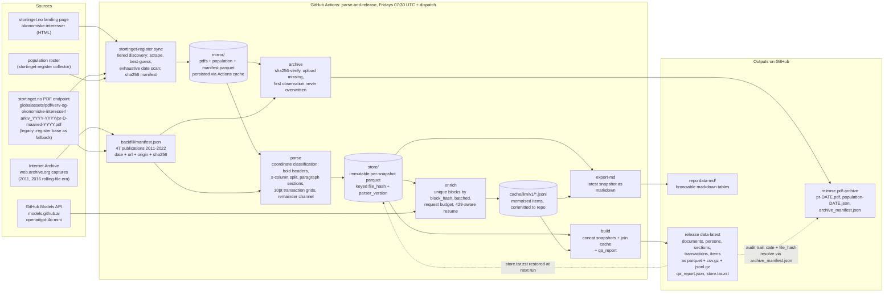

# stortingsverv-parser

Datasets from the Norwegian Parliament's register of representatives' and
government members' positions and economic interests
([Stortingsrepresentantenes verv og økonomiske interesser](https://www.stortinget.no/no/stortinget-og-demokratiet/representantene/okonomiske-interesser/)).

The sibling repo
[parse-stortingsrepresentantenes-verv-og-konomiske-interesser](https://github.com/sondreskarsten/parse-stortingsrepresentantenes-verv-og-konomiske-interesser)
mirrors the biweekly register PDFs from 2022-10-18 onward. This repo parses
the PDF text layer into tables and publishes them as GitHub release assets;
52 publications back to 2011 that its discovery misses, recovered from the live archive and
the Internet Archive, are pinned in `backfill/manifest.json`, giving the
datasets a 2011-2026 span. [docs/provenance.md](docs/provenance.md) maps
the publication regimes, what survives and what is lost. Everything runs on GitHub
Actions; enrichment uses GitHub Models. No external infrastructure.

## Data access

Two entry points:

- Browse: [`data-md/`](data-md/) holds the latest publication as plain
  markdown tables rendered directly on GitHub (persons, every registered
  interest verbatim, share transactions, model-derived items, and a
  publication index linking every source PDF).
- Download: the rolling release
  [`data-latest`](../../releases/tag/data-latest) carries the full history.
  Each table ships as `.parquet` (zstd), `.csv.gz` and `.jsonl.gz`.

```python
import pyarrow.parquet as pq, urllib.request
base = "https://github.com/sondreskarsten/stortingsverv-parser/releases/download/data-latest/"
urllib.request.urlretrieve(base + "sections.parquet", "sections.parquet")
pq.read_table("sections.parquet")
```

## Pipeline



## Tables

Every row is an observation at its publication date. Rows are never mutated;
a new publication only appends rows at its own date. Cross-snapshot meaning
(what changed, who left) is imposed at query time, not at write time.

| Table | Grain | Content |
|---|---|---|
| `documents` | publication | date, source url, file hash, page count, cover text, the full reglement text as printed in that publication, parser diagnostics |
| `persons` | publication × person block | section heading (Representanter / Regjeringsmedlemmer / Vararepresentanter), header verbatim, name / party / constituency carved from the header parentheses, empty-record note verbatim |
| `sections` | publication × person × paragraph | paragraph marker (`§2`…`§11`, `§9a`, `§15`) and label as printed, block text verbatim, block hash |
| `transactions` | printed transaction-table row | §9 share-transaction grids; cell values keyed by the table's own printed header labels (`Dato`, `Kjøp/Salg`, `Selskapsnavn`, …) in `cells_json` |
| `items` | LLM-derived item | one row per registered item split out of a section block: verbatim `item_text` plus organisation, role, remuneration, amount_nok, share_count, share_pct, org_number, date_from, date_to, country. Versioned by `model` and `prompt_version` |

`qa_report.json` carries per-snapshot person counts against the population
roster, remainder line counts and enrichment coverage.

## Provenance and PDF archive

Every dataset row traces to its source binary: `documents` carries the
publication's stortinget.no url and sha256 (`file_hash`), and the
[`pdf-archive` release](../../releases/tag/pdf-archive) stores every PDF
and population snapshot sha256-verified, independent of whether
stortinget.no keeps serving them. Assets are date-named
(`pr-YYYY-MM-DD.pdf`); if a date's content is ever replaced upstream, the
new bytes are archived additionally under a hash-suffixed name and the
first observation is never overwritten. `archive_manifest.json` on that
release maps every (date, sha256) pair to its asset and flags any mismatch
between the mirror manifest hash and the archived bytes. The workflow
archives before parsing, so a publication is preserved even if a later
step fails.

`store.tar.zst` is the internal per-snapshot store (one immutable directory
per publication, keyed on file hash and parser version) used for incremental
runs.

## How it parses

The register is a two-column Word layout. Linear text extraction destroys
the pairing between paragraph markers and their content whenever short
sections stack, so the parser classifies lines by structure only: font
weight, font size and x-position. Person headers are bold body-size lines at
the left margin; paragraph markers start left-column segments; content lives
right of a per-document column split derived from the modal content-line
x-position; §9 transaction grids are the 10 pt lines, with cells grouped by
x-gaps and mapped to the grid's own bold header row. Section headings are
large lines followed by a bold header line, which separates them from the
same-size reglement title. Anything unclassified lands in a remainder
channel and is reported per document, never silently dropped.

The deterministic layer stops at the section grain with text verbatim.
Splitting blocks into items and lifting fields out of free text is a
derived layer produced by GitHub Models (`openai/gpt-4o-mini` by default),
memoised in `cache/llm/` by block hash so only never-seen blocks cost
requests. Free-tier rate limits mean a cold bootstrap converges over a few
scheduled runs; `qa_report.json` states current coverage.

## Running locally

```bash
uv venv && uv pip install . 'git+https://github.com/sondreskarsten/parse-stortingsrepresentantenes-verv-og-konomiske-interesser.git'
uv run stortinget-register sync ./mirror
uv run stortingsverv parse ./mirror ./store
GITHUB_TOKEN=... uv run stortingsverv enrich ./store ./cache/llm --max-requests 50
uv run stortingsverv build ./store ./dist --cache ./cache/llm
uv run stortingsverv export-md ./store ./data-md --cache ./cache/llm
```

## Workflows

`parse-and-release.yml` runs Fridays 07:30 UTC and on dispatch: syncs the
mirror (cached between runs), parses new snapshots into the store (restored
from the previous release), enriches within the request budget, rebuilds
the datasets, regenerates `data-md/`, commits cache and markdown, and
updates the `data-latest` release.
`ci.yml` runs the test suite against a committed fixture publication.
